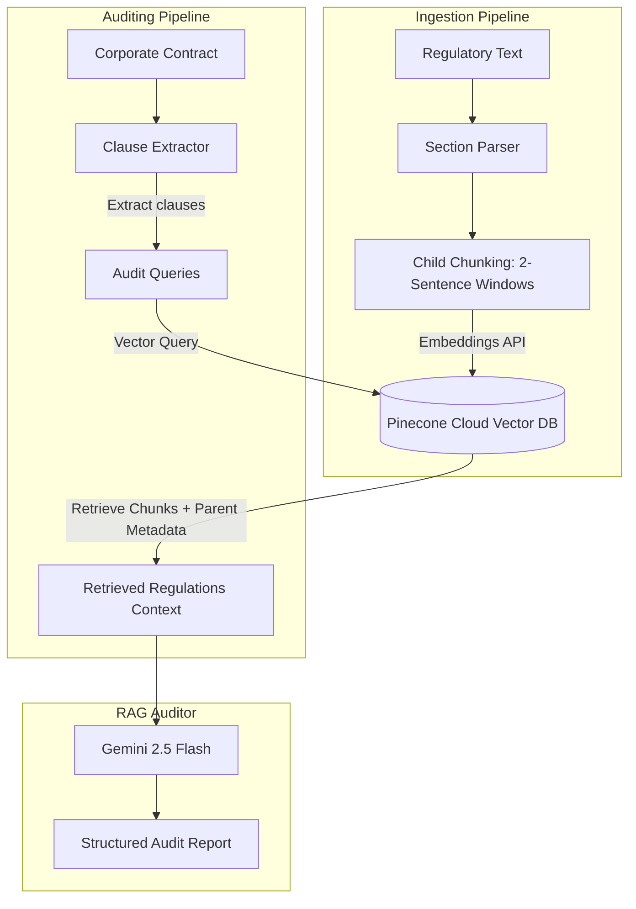

# DocuShield: Smart Regulatory & Compliance Auditor (RAG)

DocuShield is an advanced, self-contained compliance auditing application built with Node.js. It leverages Retrieval-Augmented Generation (RAG) to compare corporate agreements or policies against complex regulatory standards (e.g., GDPR, HIPAA) and automatically flags violations with exact citations and suggested compliant rewrites.

---

## Key Features

1. **Pinecone Cloud Vector Database:** Integrates **Pinecone** via `@pinecone-database/pinecone` for vector storage and querying. It automates index provisioning (Serverless AWS) and handles bulk vector ingestion.
2. **Parent-Document Retrieval:** Matches small 2-sentence child chunks during vector search for maximum semantic precision, but retrieves and sends the full parent policy/article to the LLM. This is achieved by storing parent article text inside the child vector's metadata block on Pinecone, providing the generator with complete context while avoiding database fragmentation.
3. **Automated Compliance Auditing:** Parses contracts into clauses, audits them against the regulatory database using Gemini, and outputs:
   - A **Verdict** (`COMPLIANT` / `NON-COMPLIANT` / `INSUFFICIENT_INFORMATION`)
   - A **Detailed Legal Analysis**
   - Explicit **Violations** (citing specific articles)
   - A **Suggested Clause Rewrite**

---

## System Architecture



---

## Directory Structure

```text
e:/DocuShield/
├── .env.example              # Environment configuration template
├── .gitignore                # Git exclusions (ignores secrets and generated DBs)
├── package.json              # App scripts and dependencies
├── index.js                  # Main CLI readline entry point
├── README.md                 # Detailed documentation
├── data/
│   ├── regulations/          # Regulatory texts database
│   │   └── gdpr_sample.txt   # Sample GDPR policy articles (Arts 5, 6, 17)
│   └── contracts/            # Target contracts to audit
│       └── vendor_agreement_sample.txt # Sample agreement with violations
└── src/
    ├── config.js             # Initializing Gemini client & constants
    ├── vectorDb.js           # Custom Vector DB & Cosine Similarity logic
    ├── ingest.js             # Ingests regulations, chunks, and embeds them
    └── auditor.js            # Conducts clause-level Parent-Doc RAG audits
```

---

## Setup & Installation

### 1. Clone the repository
```bash
git clone https://github.com/iHanumanBhakt/DocuShield.git
cd DocuShield
```

### 2. Install dependencies
```bash
npm install
```

### 3. Configure environment variables
Create a `.env` file in the root of the project:
```bash
cp .env.example .env
```
Open `.env` and fill in your Gemini and Pinecone API credentials:
```env
GEMINI_API_KEY=your_gemini_api_key_here
PINECONE_API_KEY=your_pinecone_api_key_here
PINECONE_INDEX=docushield
```

---

## Usage Guide

### Step 1: Ingest Regulations
Create the Pinecone index and upload the embedded regulatory texts:
```bash
npm run ingest
```
This script reads the text files in `data/regulations`, segments them, fetches embeddings using Gemini's `text-embedding-004` model, checks/provisions the Pinecone serverless index, and bulk-upserts the vectors with metadata.

### Step 2: Audit a Contract
Launch the compliance auditor:
```bash
npm start
```
1. Select the target contract (e.g., `vendor_agreement_sample.txt`) from the menu.
2. The auditor will extract each clause, generate query embeddings, search the Pinecone cloud index, resolve parent metadata, construct the RAG prompt, and output compliance assessments.
3. A copy of the full Markdown audit report will be saved to `data/audit_report.md`.

---

## Vector Similarity Metrics (Pinecone Cosine Similarity)

Pinecone performs vector database search using the **Cosine Similarity** metric:

$$\text{similarity} = \cos(\theta) = \frac{\mathbf{A} \cdot \mathbf{B}}{\|\mathbf{A}\| \|\mathbf{B}\|} = \frac{\sum_{i=1}^{n} A_i B_i}{\sqrt{\sum_{i=1}^{n} A_i^2} \sqrt{\sum_{i=1}^{n} B_i^2}}$$

This metric measures the cosine of the angle between the query embedding $\mathbf{A}$ and the document embedding $\mathbf{B}$. The output ranges from `-1.0` to `1.0`, where `1.0` indicates perfect semantic alignment.
